<div align="center">


# Shift One · Help Desk Simulator

**Work a real Tier 1 service desk shift in your browser.** Unlock accounts, chase DNS faults, spot social engineering, and get graded on what you *actually* fixed.

[](https://onesayi.github.io/shift-one-helpdesk-simulator/)
[](https://onesayi.github.io/shift-one-helpdesk-simulator/#pricing)


[Features](#-features) · [Shift 2: Phones On](#-new-shift-2-phones-on) · [Service Coordinator mode](#-new-service-coordinator-mode) · [Screenshots](#-screenshots) · [Scenarios](#-scenarios) · [How grading works](#-how-grading-works) · [Run it](#-run-it-locally) · [Tutoring](#-tutoring--pricing) · [Roadmap](#-roadmap)

</div>

---

<p align="center"></p>

## 💡 Why this exists

Most IT support training is multiple choice. Real help desks aren't. The hard parts are *judgement* calls:

- Do I verify this caller before I touch their account?
- Is this one broken laptop or one broken floor?
- Is the smallest fix enough, or do I need to restart something?
- Should I close this ticket, or does it belong to Security?

**Shift One** puts you in the chair at *Brightline Logistics*, a fictional company with 18 employees, 17 workstations, 11 network devices (including a carrier WAN link to the Denver office) and 4 servers. Tickets arrive on a timer, users reply in chat, and every tool changes a live simulated environment. When you close a ticket, the grader inspects the **state of the systems** and the **log of everything you did**. You can't bluff your way to a good score.

I built it to sharpen my own help desk skills, and I use it to tutor students preparing for their first IT support role.

## ✨ Features

| | |
|---|---|
| 🎫 **Ticket queue** | Priorities, live SLA countdowns, requester chat with scripted questions or your own typed words (ask them to "try again" and they only confirm if it's really fixed), categories, resolution notes, resolve, escalate to the right team, **or link duplicates** to a parent incident |
| 📞 **Live phone calls** | Calls ring in real time and go to voicemail if missed. Answering a second call puts the first on hold, and callers hang up after 45 seconds. Busy with something urgent? Promise a callback within 5 minutes, then keep it. You can only ask questions or verify identity while the caller is on the line |
| 👥 **Directory** | Active Directory-style user management: reset password (with *must change* / *unlock* options), unlock, reset MFA, sign out sessions, disable, group membership, profile edits, **identity verification by one-time code**, lockout source, recent sign-ins and an audit trail of recent changes |
| 🖥️ **Remote desktop** | Consent-based sessions with a live screen preview, installed apps, Windows services, time zone + DNS settings, **network isolation** for compromised devices |
| ⌨️ **Command prompt** | A working CLI: `ipconfig /all`, `nslookup`, `ping`, `tzutil`, `tasklist`, `taskkill`, `sc query`, `net start`, `netsh`, `gpupdate`, command history with ↑/↓ |
| 🗄️ **Server room** | Alerts, network topology, access points (reboot vs PoE power-cycle), switches, core router, a carrier WAN circuit with line test, servers, their services and disk contents |
| 📚 **Knowledge base** | 20 SOP articles written like a real internal wiki |
| 📊 **Shift report** | Letter grade, per-ticket breakdown of what you did well and what cost points, call stats, "collateral damage" section |
| ⏱️ **Two shifts, two modes** | Shift 1 *Day One* (11 tickets) and Shift 2 *Phones On* (9 harder tickets, mostly calls), each timed or untimed practice |
| 🌗 **Polish** | Light/dark theme, fully responsive, keyboard-friendly, zero dependencies |

## 📞 New: Shift 2, Phones On

**The harder help desk shift.** Nine new tickets, seven of them live phone calls, and most can't be fixed by the first thing you try. Calls ring while you're working other tickets, so you juggle holds, call back voicemails, and still have to find the real root cause.

<table>
<tr>
<td width="50%">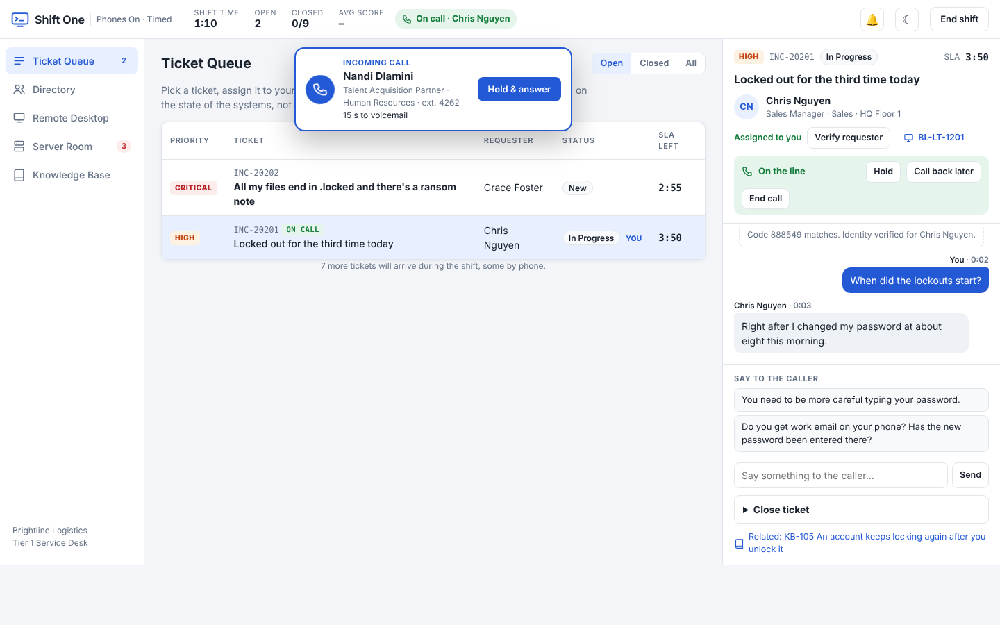<p align="center"><b>Phones</b>: a second caller rings while you're mid-call with the first</p></td>
<td width="50%">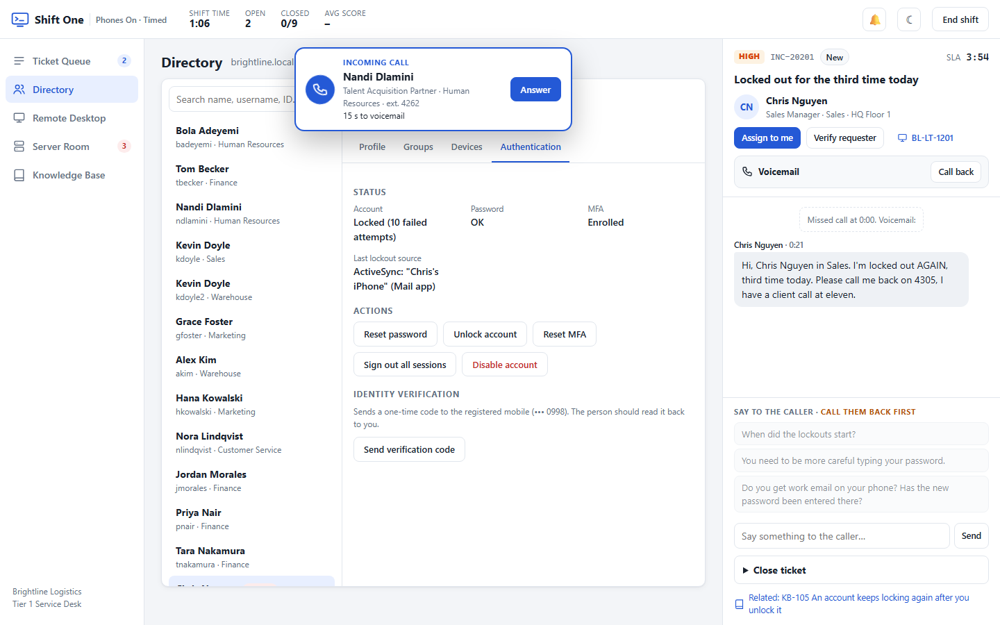<p align="center"><b>Voicemail</b>: missed calls need a call back, and the lockout source points at the real cause</p></td>
</tr>
<tr>
<td>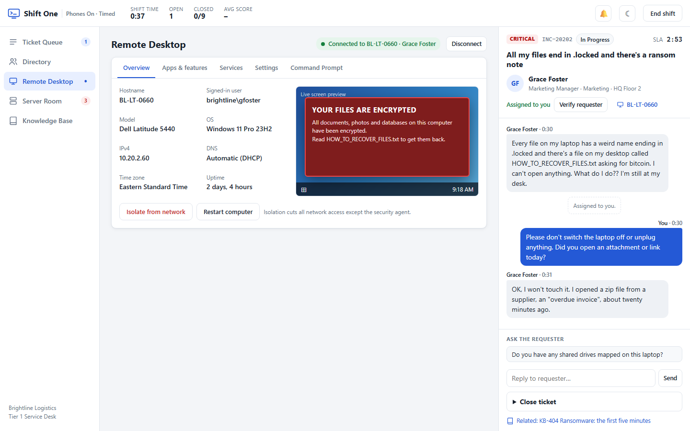<p align="center"><b>Ransomware</b>: isolate the laptop before it spreads to the file server</p></td>
<td>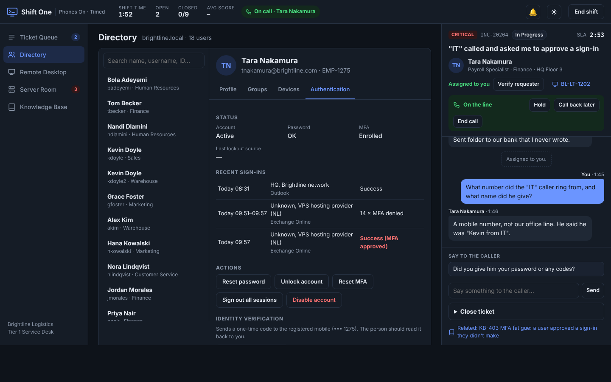<p align="center"><b>MFA fatigue</b>: recent sign-ins show the attacker's approved session</p></td>
</tr>
<tr>
<td>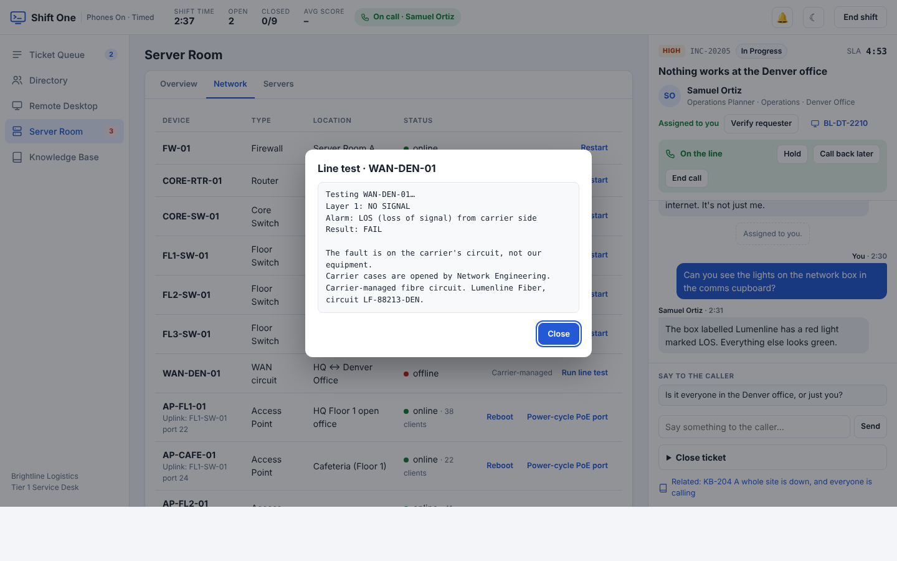<p align="center"><b>Site outage</b>: a line test proves it's the carrier, and the second caller is a duplicate</p></td>
<td>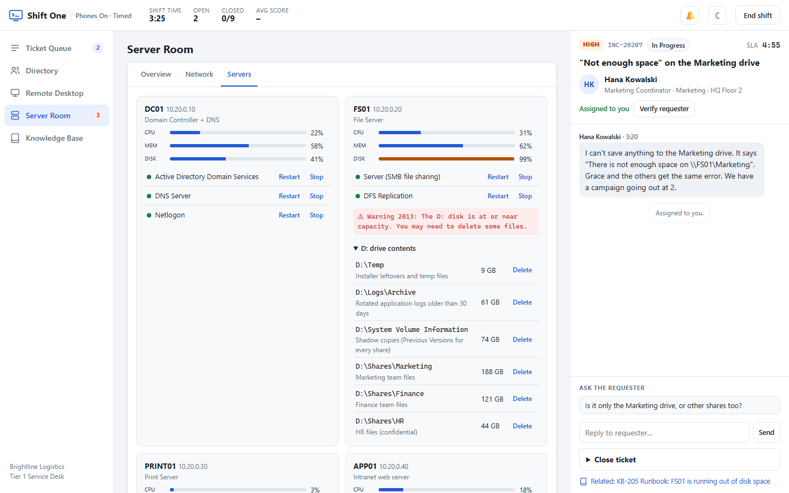<p align="center"><b>Disk full</b>: the runbook allows two folders. The rest is user data or backups</p></td>
</tr>
</table>

| # | Ticket | Channel | Skill it tests |
|---|---|---|---|
| 1 | Locked out for the third time today | 📞 Call | Root cause: the old password is still saved in his phone's Mail app. Unlock without fixing it and he locks again |
| 2 | All my files end in .locked | Portal | Ransomware first response: isolate fast, don't restart, escalate to Security |
| 3 | VPN won't connect from home | 📞 Call | Reading the error, the audit trail, and restoring access only after verifying the caller |
| 4 | "IT" called and asked me to approve a sign-in | 📞 Call | MFA fatigue: reset the password, end sessions, **reset MFA**, escalate |
| 5–6 | Nothing works at the Denver office (×2 callers) | 📞 Calls | Major incident: line test, one escalation, link the duplicate |
| 7 | "Not enough space" on the Marketing drive | Portal | Following a runbook exactly: what you may delete, and what you must never delete |
| 8 | Needs admin rights NOW for a client demo | 📞 Call | De-escalating an angry caller and solving the real need without admin rights |
| 9 | Reset a colleague's password so I can read her email | 📞 Call | Saying no to account sharing, and offering the proper route |

## 🗓️ New: Service Coordinator mode

**Run the dispatch desk at a managed service provider.** A second simulator ([`dispatch.html`](dispatch.html)) puts you in the MSP service coordinator's seat, the remote role that MSP staffing firms like Support Adventure place with MSPs. You don't fix tickets. You triage them, answer the phones, keep clients inside their SLAs, chase approvals and vendors, and put the right technician on the right job at the right time.

| | |
|---|---|
| 🏢 **Northbound IT** | A fictional MSP with 5 technicians (Tier 1 to Tier 3, a field tech, a remote engineer in Cape Town) and 5 clients on premium, standard, co-managed and block-hours agreements |
| 📞 **Live phones** | Calls ring on a sim clock. Miss one and it becomes a voicemail and an unhappy client |
| 🧭 **Triage** | Impact × urgency matrix, boards, skills, remote vs onsite, estimates, plus overrides for security incidents and backups |
| 🗓️ **Dispatch Board** | Today and tomorrow for every tech: lunch, meetings, project time, travel, existing jobs. It blocks double-booking and warns about skills, onsite windows, block hours and approvals |
| 🧑‍🔧 **Simulated technicians** | Booked work runs itself. The wrong skills bounce back, P1s can pull a tech off other work, and a tech goes home sick mid-morning |
| 🤝 **Coordination** | Client message templates, authorized-contact approvals, Service Manager and Account Manager escalations, ISP and RMA vendor cases, merging duplicates, closing with a reason |
| 📈 **KPI report** | Time to triage, first response in SLA, missed calls, client chasers, wrong-tech dispatches and technician utilization, plus per-ticket feedback explaining the right call |

<table>
<tr>
<td width="50%">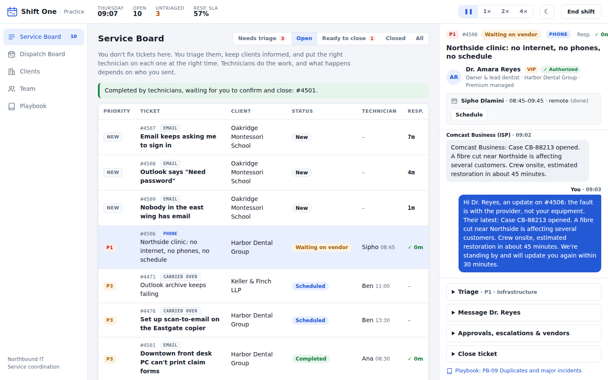<p align="center"><b>Service Board</b>: a P1 clinic outage waiting on the ISP, with the client updated</p></td>
<td width="50%">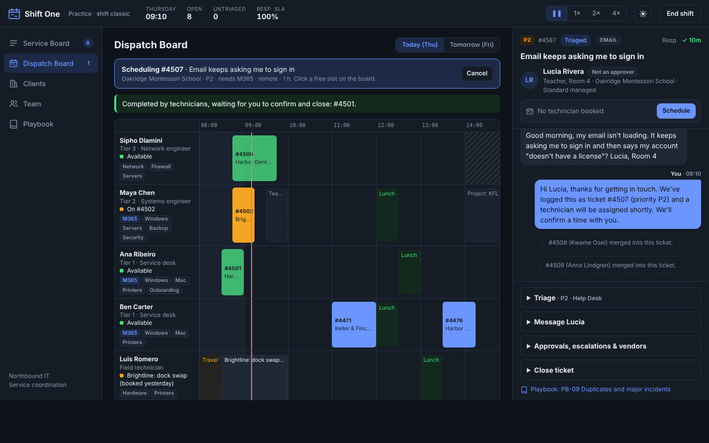<p align="center"><b>Dispatch Board</b>: five technicians, skills, lunches, travel and a live now-line</p></td>
</tr>
<tr>
<td>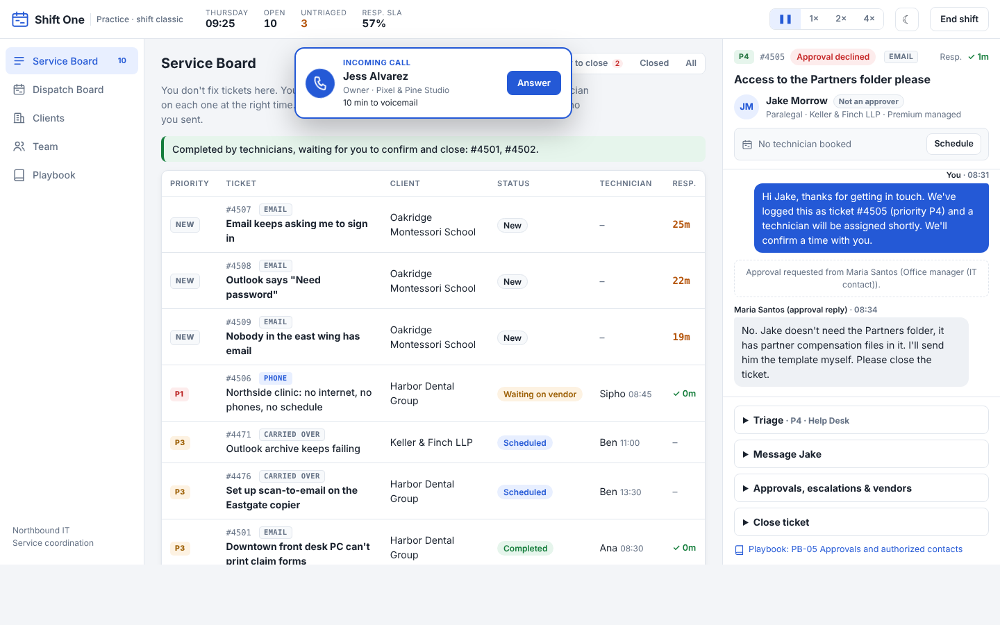<p align="center"><b>Phones</b>: answer before it goes to voicemail</p></td>
<td>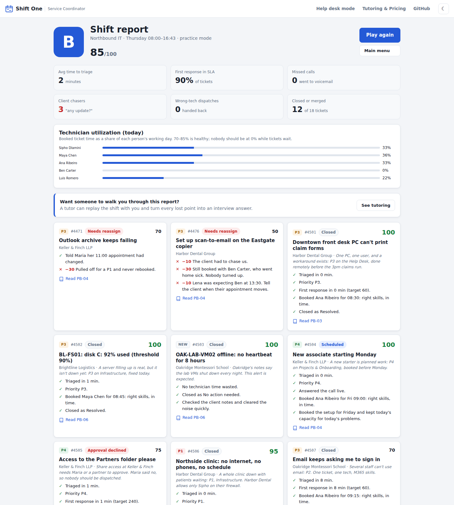<p align="center"><b>Shift report</b>: KPIs, utilization and per-ticket feedback</p></td>
</tr>
</table>

Every shift draws 16–18 tickets from a pool of 25 and shuffles when they arrive, so no two shifts play the same. Each shift has a short code you can type in to replay it (or share it with a tutor), and the code `classic` gives the original fixed shift. The pool includes a clinic-wide outage that needs an ISP case, three duplicate reports of one M365 outage, a paralegal asking for partner-only files, a client out of prepaid hours, an RMA install that has to fit a dental clinic's lunch hour, and a lookalike-domain request to forward the managing partner's mail to Gmail, and a leased copier that only the vendor may touch. Design notes, the research behind it and a tutor answer key are in **[docs/COORDINATOR.md](docs/COORDINATOR.md)**.

## 📸 Screenshots

<table>
<tr>
<td width="50%"><p align="center"><b>Ticket queue</b>: SLAs, priorities and live chat with the requester</p></td>
<td width="50%"><p align="center"><b>Directory</b>: verify identity before touching the account</p></td>
</tr>
<tr>
<td><p align="center"><b>Command prompt</b>: <code>nslookup</code> fails, <code>ping</code> by IP works → it's DNS</p></td>
<td><p align="center"><b>Remote desktop</b>: live screen preview of the user's adware problem</p></td>
</tr>
<tr>
<td><p align="center"><b>Server room</b>: alerts and topology point at the real fault</p></td>
<td><p align="center"><b>Social engineering</b>: the "CFO" can't pass verification</p></td>
</tr>
<tr>
<td><p align="center"><b>Apps &amp; features</b>: remove the adware, keep the security agent</p></td>
<td><p align="center"><b>Servers</b>: one stopped Print Spooler, a whole floor can't print</p></td>
</tr>
<tr>
<td><p align="center"><b>Shift report</b>: every point explained</p></td>
<td><p align="center"><b>Tutoring &amp; pricing</b>: built-in, configurable billing page</p></td>
</tr>
</table>

<p align="center"><br><b>Works on phones too</b></p>

## 🎯 Scenarios

**Shift 1: Day One.** Eleven tickets, each testing a real Tier 1 skill. Several contain a trap that catches technicians who skip process. (Shift 2's tickets are [listed above](#-new-shift-2-phones-on).)

| # | Ticket | Priority | Skill it tests |
|---|---|---|---|
| 1 | Locked out, month-end close today | High | Identity verification, unlock vs reset |
| 2 | Wi-Fi down in the cafeteria | High | Scoping, access points, PoE, *smallest safe fix* |
| 3 | My clock is an hour behind | Low | Time zones, checking the user's location first |
| 4 | Can't open the Finance shared drive | Medium | Group-based access, **data-owner approval**, least privilege |
| 5 | Pop-up ads everywhere | Medium | Adware removal without removing security tools |
| 6 | Printing doesn't work | High | "Is it just you?": one user vs a whole floor |
| 7 | Intranet won't open, internet is fine | Medium | DNS troubleshooting with `nslookup` / `ipconfig` |
| 8 | Name change after marriage | Low | Profile + email changes with an HR reference |
| 9 | I entered my password on a fake page | Critical | Phishing containment + escalation to Security |
| 10 | Leaver: Kevin Doyle | High | Offboarding, and matching the **employee ID** (there are two Kevin Doyles) |
| 11 | URGENT: CFO locked out, boarding now | Critical | Social engineering: urgency, rank, external email |

> Instructors: full walkthroughs and an answer key are in the [Tutor Guide](docs/TUTOR_GUIDE.md).

## 🧮 How grading works

Every action (unlocking an account, restarting a service, running a command) is appended to an **event log**. Closing a ticket runs that ticket's grader against the **world state** and the log.

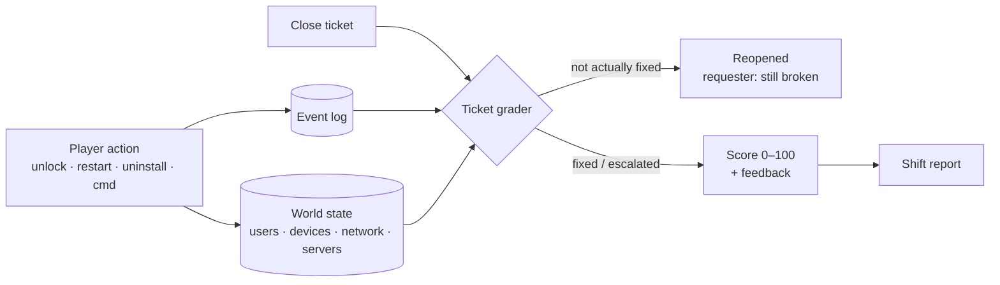

| What's checked | Example | Points |
|---|---|---|
| Is it actually fixed? | Account still locked → ticket **reopens** | −15 per reopen |
| Safe process | Reset a password *before* verifying the caller | −25 |
| Least privilege | Adding a new analyst to `Domain Admins` | −30 |
| Right outcome | Closing a phishing report yourself instead of escalating to Security | −30 |
| Collateral damage | Restarting the core switch to fix one access point | −30 |
| Documentation | A note like "fixed" | −10 |
| SLA | Closing a High ticket after 5 minutes (timed mode) | −15 |
| Root cause | Unlocking an account without fixing the phone that keeps locking it | −10 per relock |
| Phones | Letting a call go to voicemail, leaving a caller on hold until they hang up, or breaking a "call you back in 5 minutes" promise | −10 each |
| Soft skills | Telling an upset caller to "calm down", or asking a user for their password | −10 |
| Major incidents | Escalating a second report of the same outage instead of linking it | −10 |

## 🚀 Run it locally

No install, no build. Just a static site.

```bash
git clone https://github.com/Onesayi/shift-one-helpdesk-simulator.git
cd shift-one-helpdesk-simulator
python -m http.server 8765
```

Open **http://localhost:8765** for the help desk simulator, or **http://localhost:8765/dispatch.html** for Service Coordinator mode. (Double-clicking either HTML file works too.)

### Deploy your own copy

The repo includes a GitHub Actions workflow that publishes to **GitHub Pages** on every push to `main`. Enable it under **Settings → Pages → Source: GitHub Actions**.

## 🏗️ Architecture

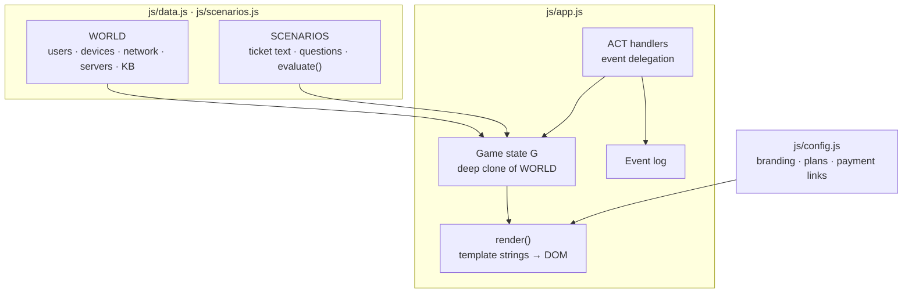

```
├── index.html            help desk simulator shell
├── dispatch.html         Service Coordinator mode shell
├── css/
│   ├── styles.css        design tokens, light/dark themes, responsive layout
│   └── dispatch.css      dispatch board, call card, coordinator extras
├── js/
│   ├── config.js         branding, pricing plans, payment links  ← edit me
│   ├── data.js           the simulated company + knowledge base
│   ├── scenarios.js      tickets and their graders
│   ├── app.js            engine, tools, rendering
│   └── dispatch/         Service Coordinator mode: MSP data, scenarios, engine
├── docs/                 guides, screenshots, banner, demo GIF
├── tools/                screenshot automation (headless browser + Pillow)
└── .github/              Pages deployment, issue templates
```

**Design decisions**
- **Zero dependencies.** Opens from disk, deploys anywhere, nothing to patch or audit.
- **Event-sourced grading.** Graders read *what happened*, so order-sensitive rules ("verified *before* reset") are one line of code.
- **Data-driven scenarios.** A new ticket is one object in `scenarios.js`; see [Authoring scenarios](docs/AUTHORING.md).
- **Honest simulation.** Fake answers don't work: ping by IP still succeeds when DNS is broken, an offline AP ignores reboot requests, and killing an adware process doesn't stop it respawning.

## 🎓 Tutoring & pricing

The simulator is free. I also offer paid coaching built around it:

| Plan | Price | What you get |
|---|---|---|
| **Self-study** | Free | The full simulator |
| **1:1 Tutoring** | R450 / 60 min | Live coached shift + report debrief |
| **Interview Prep Pack** | R1,500 / 4 sessions | Mock help desk interview, job-matched scenarios, CV feedback |
| **Classroom & Bootcamp** | Quote | Group workshops, lesson plans, custom scenario packs |

Pricing lives in [`js/config.js`](js/config.js) and appears on the in-app **Tutoring & Pricing** page. Payments use hosted checkout links (Paystack in South Africa, or Stripe elsewhere), so no backend or card data touches the site. Setup: [docs/BILLING.md](docs/BILLING.md).

## 🧠 Skills demonstrated

**Service coordination:** PSA-style triage (impact × urgency), SLA management, skills-based dispatch and scheduling, client communication, approvals from authorized contacts, vendor/RMA management, block-hours billing, major incident handling.

**IT support:** Active Directory concepts (accounts, groups, lockout policy), identity verification, least privilege, DNS/DHCP, Wi-Fi and PoE, print servers, Windows services, adware removal, phishing response, offboarding, ITIL-style incident management (priority, SLA, escalation, documentation).

**Software:** vanilla JavaScript state management, event-sourced scoring, accessible responsive UI with CSS design tokens and dark mode, automated screenshot and GIF pipeline (headless Chromium + Pillow), CI/CD to GitHub Pages.

## 🗺️ Roadmap

- [x] 11 scenarios, 5 tools, working command prompt
- [x] Shift 2 *Phones On*: 9 harder tickets, live calls with hold and voicemail, root-cause traps
- [x] Timed + practice modes, shift report
- [x] Light/dark theme, mobile layout
- [x] Tutoring & pricing page with payment links
- [x] Service Coordinator mode: MSP dispatch board, phones, SLAs, approvals, vendors
- [ ] Randomised scenario variants (different users/devices each run)
- [ ] Mail admin tool: message trace, quarantine release
- [ ] Asset management + hardware shipping tickets
- [ ] Save progress and per-skill stats
- [ ] AI requesters: free-text chat backed by an LLM persona (grader stays deterministic)
- [ ] Spoken calls: text-to-speech callers and speech-to-text answers
- [ ] Accounts, leaderboards and a classroom dashboard

Have an idea? [Request a scenario](../../issues/new?template=scenario_request.md).

## 🔧 Regenerating screenshots

```bash
pip install pillow
python tools/screenshots.py
```

Renders every screenshot, the phone mockup, the demo GIF and the banner with headless Edge/Chrome. Scenes are staged in [`tools/shot.html`](tools/shot.html).

## 📄 License

Source-available for portfolio review and personal learning. Commercial use, redistribution, or use in paid training requires permission. See [LICENSE](LICENSE).

## 👤 Author

**Alistair Nhiwatiwa**, IT Support Technician · CompTIA Network+ · studying toward CCNA
Eight years as the sole IT support function for a 24/7 hotel and spa in Kempton Park, South Africa.

[](https://linkedin.com/in/alistair-nhiwatiwa)
[](https://github.com/Onesayi)
[](https://www.youtube.com/playlist?list=PLFZtPsciWGKA21PdcfbpKMSxO2_qmacv3)

**More of my work**

| Project | What it is |
|---|---|
| [CCNA Mega Lab](https://github.com/Onesayi/ccna-mega-lab) | Two-site enterprise network in Packet Tracer: OSPF, VLANs, EtherChannel, HSRP, NAT, IPv6 |
| [Active Directory & SIEM Lab](https://github.com/Onesayi/active-directory-siem-lab) | Domain controller, Sysmon and Splunk with simulated attacks and documented detections |
| [ConnectWise PSA Tutorial](https://github.com/Onesayi/connectwise-psa-tutorial) | Seven-lesson beginner guide to the MSP ticketing platform |
| [PacketPath Academy](https://www.youtube.com/playlist?list=PLFZtPsciWGKA21PdcfbpKMSxO2_qmacv3) | YouTube channel on networking fundamentals and CCNA prep |

<sub>Brightline Logistics, Northbound IT, their clients and everyone who works there are fictional. Support Adventure is mentioned only to describe the real-world role this mode trains for; this project isn't affiliated with them. Product names such as Windows and Microsoft 365 are used only to make the simulation realistic.</sub>
