<div align="center">

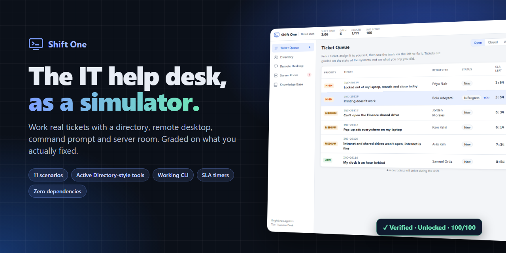

# Shift One · Help Desk Simulator

**Work a real Tier 1 service desk shift in your browser.** Unlock accounts, chase DNS faults, spot social engineering, and get graded on what you *actually* fixed.

[](https://onesayi.github.io/shift-one-helpdesk-simulator/)
[](https://onesayi.github.io/shift-one-helpdesk-simulator/#pricing)


[Features](#-features) · [Screenshots](#-screenshots) · [Scenarios](#-scenarios) · [How grading works](#-how-grading-works) · [Run it](#-run-it-locally) · [Tutoring](#-tutoring--pricing) · [Roadmap](#-roadmap)

</div>

---

<p align="center">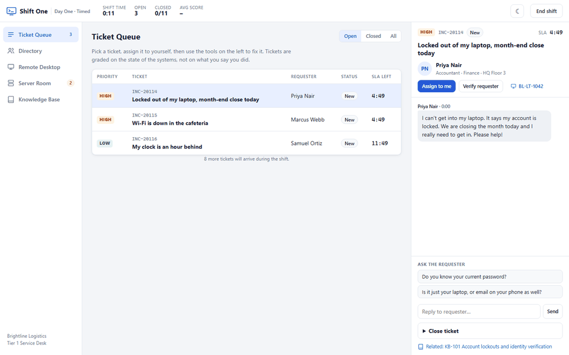</p>

## 💡 Why this exists

Most IT support training is multiple choice. Real help desks aren't. The hard parts are *judgement* calls:

- Do I verify this caller before I touch their account?
- Is this one broken laptop or one broken floor?
- Is the smallest fix enough, or do I need to restart something?
- Should I close this ticket, or does it belong to Security?

**Shift One** puts you in the chair at *Brightline Logistics*, a fictional company with 14 employees, 13 workstations, 10 network devices and 4 servers. Tickets arrive on a timer, users reply in chat, and every tool changes a live simulated environment. When you close a ticket, the grader inspects the **state of the systems** and the **log of everything you did**. You can't bluff your way to a good score.

I built it to sharpen my own help desk skills, and I use it to tutor students preparing for their first IT support role.

## ✨ Features

| | |
|---|---|
| 🎫 **Ticket queue** | Priorities, live SLA countdowns, requester chat with scripted questions, categories, resolution notes, resolve **or** escalate to the right team |
| 👥 **Directory** | Active Directory-style user management: reset password (with *must change* / *unlock* options), unlock, reset MFA, sign out sessions, disable, group membership, profile edits, **identity verification by one-time code** |
| 🖥️ **Remote desktop** | Consent-based sessions with a live screen preview, installed apps, Windows services, time zone + DNS settings |
| ⌨️ **Command prompt** | A working CLI: `ipconfig /all`, `nslookup`, `ping`, `tzutil`, `tasklist`, `taskkill`, `sc query`, `net start`, `netsh`, `gpupdate`, command history with ↑/↓ |
| 🗄️ **Server room** | Alerts, network topology, access points (reboot vs PoE power-cycle), switches, core router, servers and their services |
| 📚 **Knowledge base** | 11 SOP articles written like a real internal wiki |
| 📊 **Shift report** | Letter grade, per-ticket breakdown of what you did well and what cost points, "collateral damage" section |
| ⏱️ **Two modes** | Timed shift (tickets arrive over ~6 minutes) or untimed practice |
| 🌗 **Polish** | Light/dark theme, fully responsive, keyboard-friendly, zero dependencies |

## 📸 Screenshots

<table>
<tr>
<td width="50%">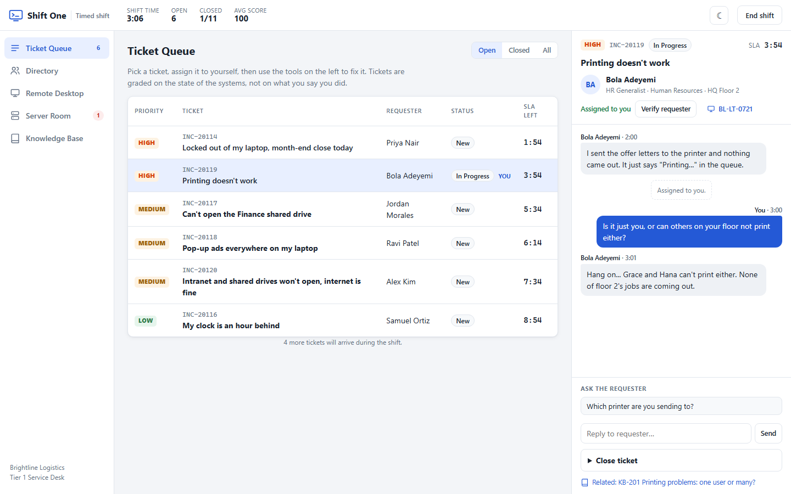<p align="center"><b>Ticket queue</b>: SLAs, priorities and live chat with the requester</p></td>
<td width="50%">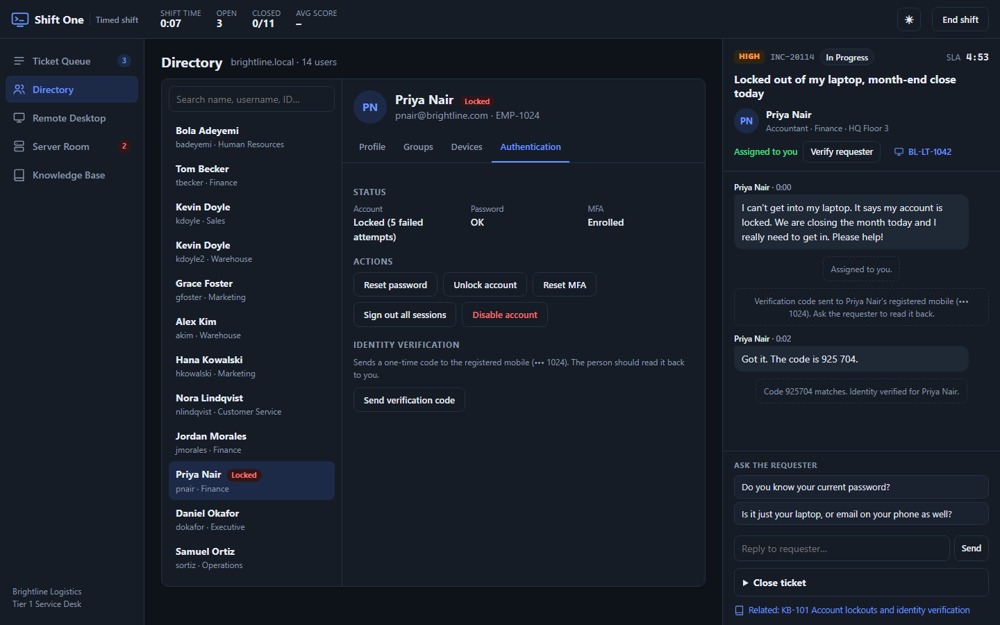<p align="center"><b>Directory</b>: verify identity before touching the account</p></td>
</tr>
<tr>
<td>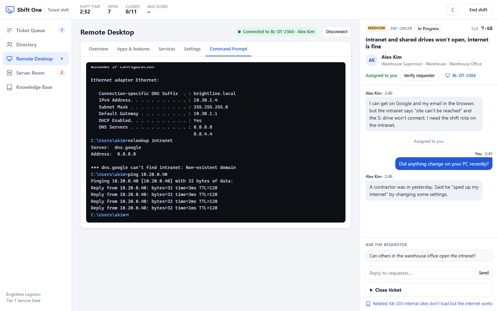<p align="center"><b>Command prompt</b>: <code>nslookup</code> fails, <code>ping</code> by IP works → it's DNS</p></td>
<td>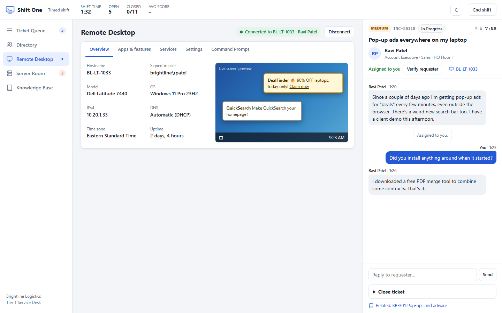<p align="center"><b>Remote desktop</b>: live screen preview of the user's adware problem</p></td>
</tr>
<tr>
<td>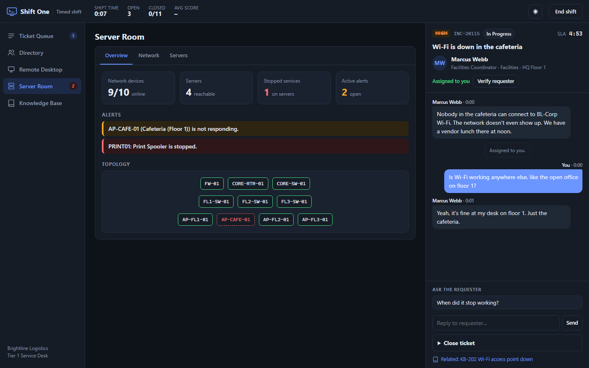<p align="center"><b>Server room</b>: alerts and topology point at the real fault</p></td>
<td>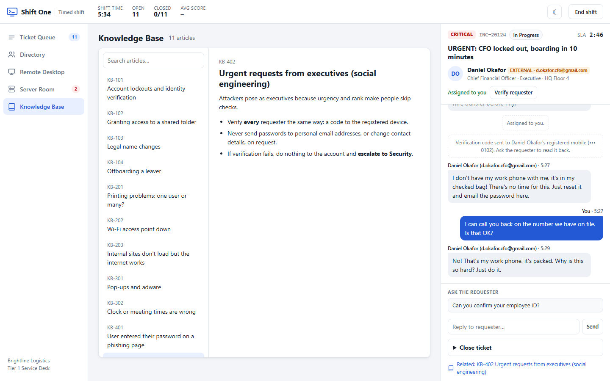<p align="center"><b>Social engineering</b>: the "CFO" can't pass verification</p></td>
</tr>
<tr>
<td>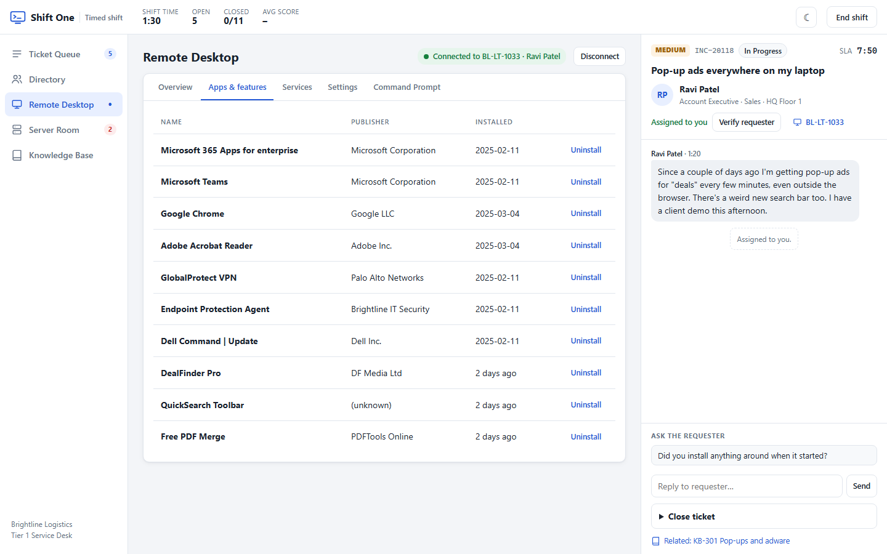<p align="center"><b>Apps &amp; features</b>: remove the adware, keep the security agent</p></td>
<td>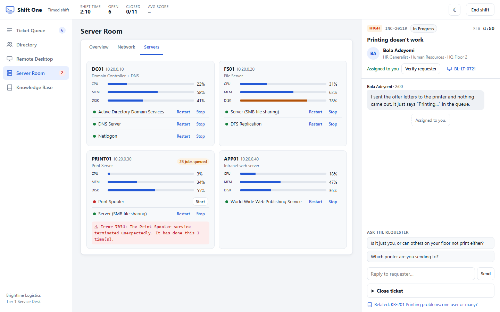<p align="center"><b>Servers</b>: one stopped Print Spooler, a whole floor can't print</p></td>
</tr>
<tr>
<td>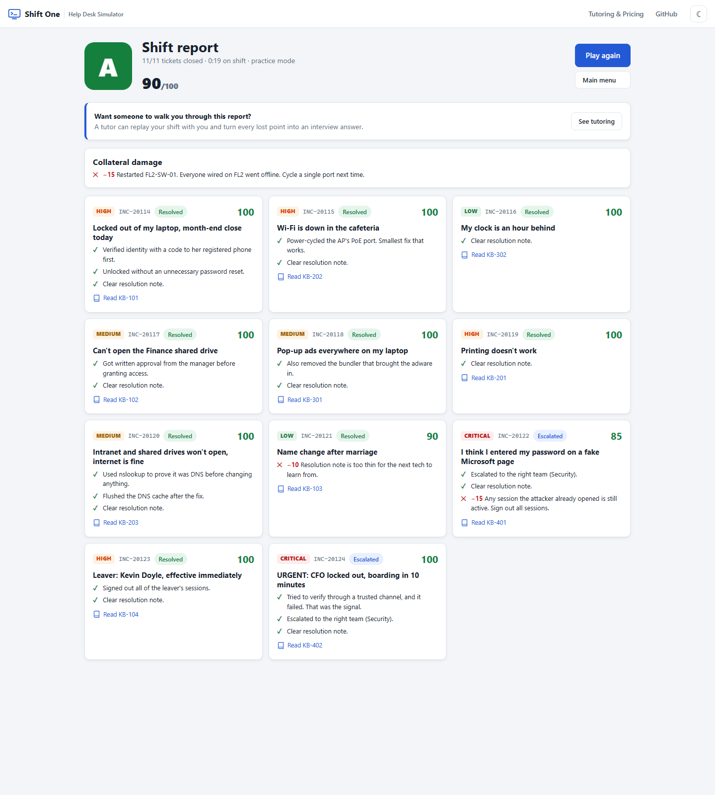<p align="center"><b>Shift report</b>: every point explained</p></td>
<td>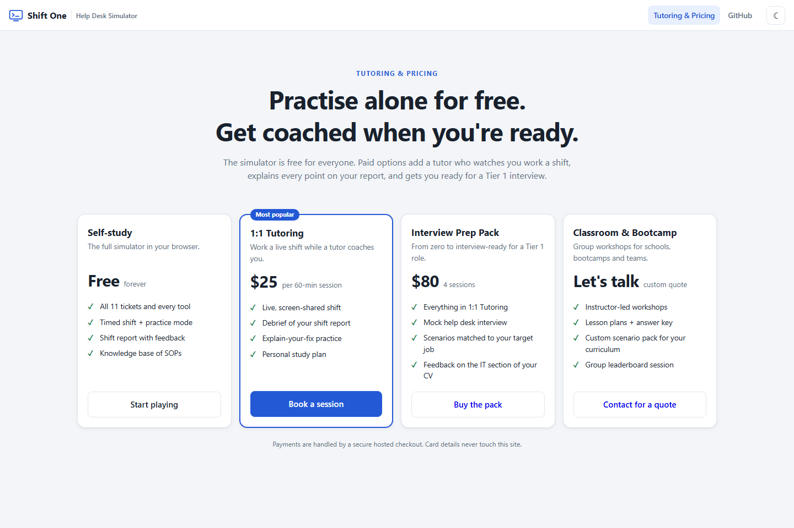<p align="center"><b>Tutoring &amp; pricing</b>: built-in, configurable billing page</p></td>
</tr>
</table>

<p align="center">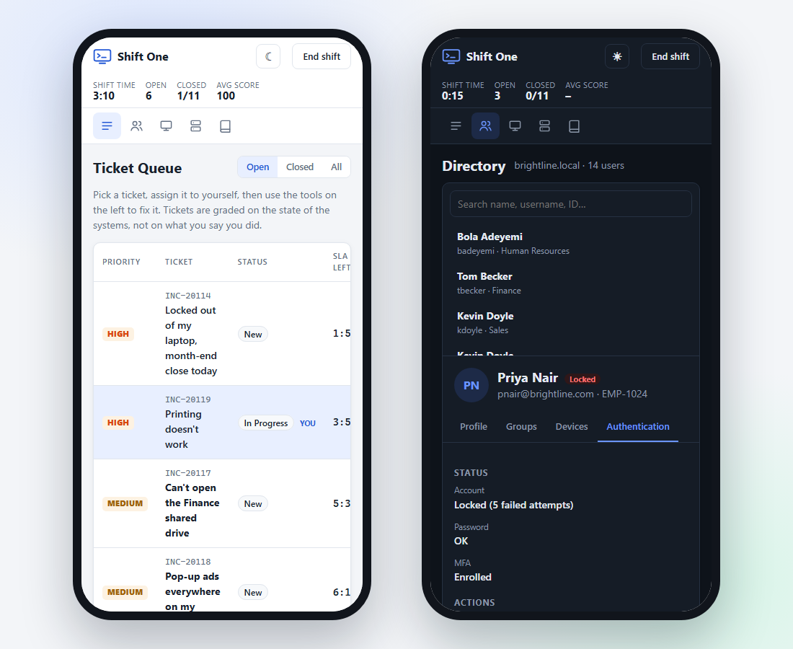<br><b>Works on phones too</b></p>

## 🎯 Scenarios

Eleven tickets, each testing a real Tier 1 skill. Several contain a trap that catches technicians who skip process.

| # | Ticket | Priority | Skill it tests |
|---|---|---|---|
| 1 | Locked out, month-end close today | High | Identity verification, unlock vs reset |
| 2 | Wi-Fi down in the cafeteria | High | Scoping, access points, PoE, *smallest safe fix* |
| 3 | My clock is an hour behind | Low | Time zones, checking the user's location first |
| 4 | Can't open the Finance shared drive | Medium | Group-based access, **data-owner approval**, least privilege |
| 5 | Pop-up ads everywhere | Medium | Adware removal without removing security tools |
| 6 | Printing doesn't work | High | "Is it just you?": one user vs a whole floor |
| 7 | Intranet won't open, internet is fine | Medium | DNS troubleshooting with `nslookup` / `ipconfig` |
| 8 | Name change after marriage | Low | Profile + email changes with an HR reference |
| 9 | I entered my password on a fake page | Critical | Phishing containment + escalation to Security |
| 10 | Leaver: Kevin Doyle | High | Offboarding, and matching the **employee ID** (there are two Kevin Doyles) |
| 11 | URGENT: CFO locked out, boarding now | Critical | Social engineering: urgency, rank, external email |

> Instructors: full walkthroughs and an answer key are in the [Tutor Guide](docs/TUTOR_GUIDE.md).

## 🧮 How grading works

Every action (unlocking an account, restarting a service, running a command) is appended to an **event log**. Closing a ticket runs that ticket's grader against the **world state** and the log.

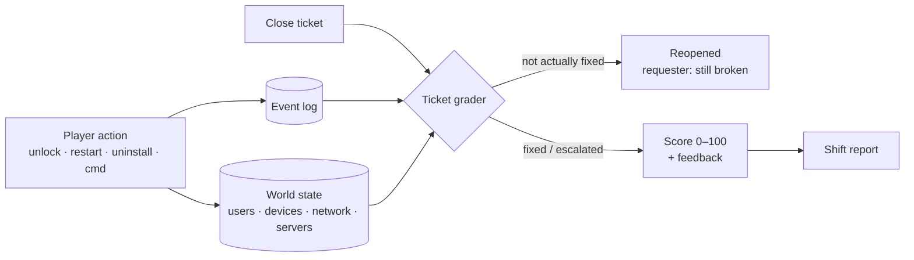

| What's checked | Example | Points |
|---|---|---|
| Is it actually fixed? | Account still locked → ticket **reopens** | −15 per reopen |
| Safe process | Reset a password *before* verifying the caller | −25 |
| Least privilege | Adding a new analyst to `Domain Admins` | −30 |
| Right outcome | Closing a phishing report yourself instead of escalating to Security | −30 |
| Collateral damage | Restarting the core switch to fix one access point | −30 |
| Documentation | A note like "fixed" | −10 |
| SLA | Closing a High ticket after 5 minutes (timed mode) | −15 |

## 🚀 Run it locally

No install, no build. Just a static site.

```bash
git clone https://github.com/Onesayi/shift-one-helpdesk-simulator.git
cd shift-one-helpdesk-simulator
python -m http.server 8765
```

Open **http://localhost:8765**. (Double-clicking `index.html` works too.)

### Deploy your own copy

The repo includes a GitHub Actions workflow that publishes to **GitHub Pages** on every push to `main`. Enable it under **Settings → Pages → Source: GitHub Actions**.

## 🏗️ Architecture

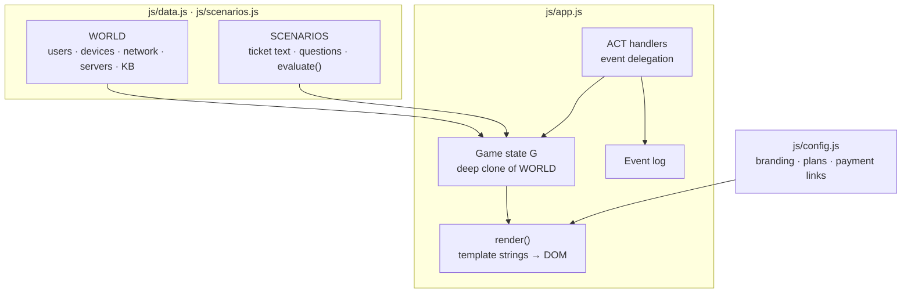

```
├── index.html            app shell
├── css/styles.css        design tokens, light/dark themes, responsive layout
├── js/
│   ├── config.js         branding, pricing plans, payment links  ← edit me
│   ├── data.js           the simulated company + knowledge base
│   ├── scenarios.js      tickets and their graders
│   └── app.js            engine, tools, rendering
├── docs/                 guides, screenshots, banner, demo GIF
├── tools/                screenshot automation (headless browser + Pillow)
└── .github/              Pages deployment, issue templates
```

**Design decisions**
- **Zero dependencies.** Opens from disk, deploys anywhere, nothing to patch or audit.
- **Event-sourced grading.** Graders read *what happened*, so order-sensitive rules ("verified *before* reset") are one line of code.
- **Data-driven scenarios.** A new ticket is one object in `scenarios.js`; see [Authoring scenarios](docs/AUTHORING.md).
- **Honest simulation.** Fake answers don't work: ping by IP still succeeds when DNS is broken, an offline AP ignores reboot requests, and killing an adware process doesn't stop it respawning.

## 🎓 Tutoring & pricing

The simulator is free. I also offer paid coaching built around it:

| Plan | Price | What you get |
|---|---|---|
| **Self-study** | Free | The full simulator |
| **1:1 Tutoring** | $25 / 60 min | Live coached shift + report debrief |
| **Interview Prep Pack** | $80 / 4 sessions | Mock help desk interview, job-matched scenarios, CV feedback |
| **Classroom & Bootcamp** | Quote | Group workshops, lesson plans, custom scenario packs |

Pricing lives in [`js/config.js`](js/config.js) and appears on the in-app **Tutoring & Pricing** page. Payments use hosted checkout links (e.g. Stripe Payment Links), so no backend or card data touches the site. Setup: [docs/BILLING.md](docs/BILLING.md).

## 🧠 Skills demonstrated

**IT support:** Active Directory concepts (accounts, groups, lockout policy), identity verification, least privilege, DNS/DHCP, Wi-Fi and PoE, print servers, Windows services, adware removal, phishing response, offboarding, ITIL-style incident management (priority, SLA, escalation, documentation).

**Software:** vanilla JavaScript state management, event-sourced scoring, accessible responsive UI with CSS design tokens and dark mode, automated screenshot and GIF pipeline (headless Chromium + Pillow), CI/CD to GitHub Pages.

## 🗺️ Roadmap

- [x] 11 scenarios, 5 tools, working command prompt
- [x] Timed + practice modes, shift report
- [x] Light/dark theme, mobile layout
- [x] Tutoring & pricing page with payment links
- [ ] Randomised scenario variants (different users/devices each run)
- [ ] Mail admin tool: message trace, quarantine release
- [ ] Asset management + hardware shipping tickets
- [ ] Save progress and per-skill stats
- [ ] AI requesters: free-text chat backed by an LLM persona (grader stays deterministic)
- [ ] Voice-call tickets
- [ ] Accounts, leaderboards and a classroom dashboard

Have an idea? [Request a scenario](../../issues/new?template=scenario_request.md).

## 🔧 Regenerating screenshots

```bash
pip install pillow
python tools/screenshots.py
```

Renders every screenshot, the phone mockup, the demo GIF and the banner with headless Edge/Chrome. Scenes are staged in [`tools/shot.html`](tools/shot.html).

## 📄 License

Source-available for portfolio review and personal learning. Commercial use, redistribution, or use in paid training requires permission. See [LICENSE](LICENSE).

## 👤 Author

**Alistair Nhiwatiwa**. IT support and help desk tutoring.
GitHub: [@Onesayi](https://github.com/Onesayi)

<sub>Brightline Logistics and everyone who works there are fictional. Product names such as Windows and Microsoft 365 are used only to make the simulation realistic.</sub>
